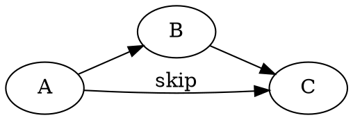
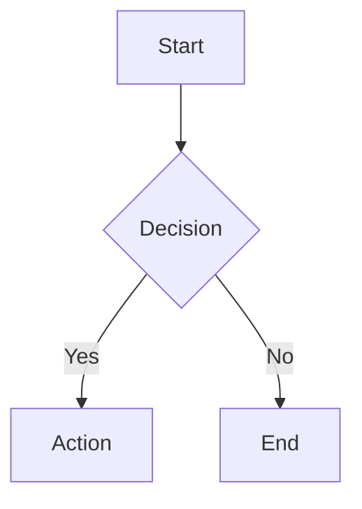
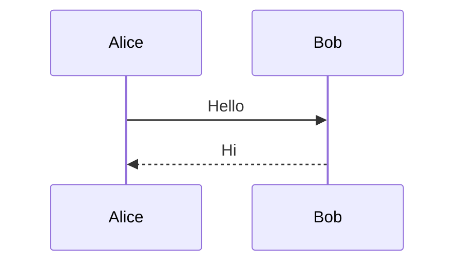
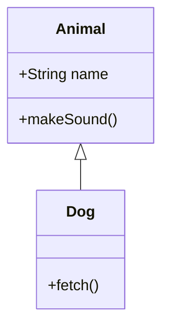
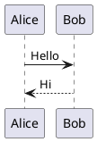
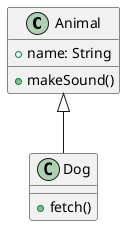
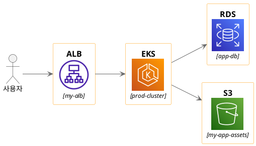

# Kroki Diagram Generator

Generate diagrams from plain text descriptions using the Kroki HTTP API at `https://kroki.io`.

## Workflow

### Phase 1: Recommend — ALWAYS do this before generating

When a user asks for a diagram, **do NOT immediately generate it**. Instead:

1. Analyze the user's intent — what are they trying to visualize?
2. Select the **top 3 most suitable diagram types** from the Supported Types table below.
3. For each candidate, write a **concise example** (3–8 lines) showing how the user's concept would look in that syntax.
4. Present the recommendations and ask which one to use (or if they want a different type).

Output format for recommendations:

```
## Recommended Diagram Types

### 1. {Type Name} — {one-line reason}
{example code block}

### 2. {Type Name} — {one-line reason}
{example code block}

### 3. {Type Name} — {one-line reason}
{example code block}
```

Only proceed to Phase 2 after the user confirms their choice.

### Phase 2: Generate

Once the user has chosen a diagram type:

1. Write the full diagram source code.
2. Send it to Kroki using POST plain-text via `python3` one-liner.
3. Save the output to a file and report the path.

#### Generation command

```bash
python3 -c "
import urllib.request, sys, json

source = sys.stdin.read()
data = json.dumps({
    'diagram_source': source,
    'diagram_type': '{TYPE}',
    'output_format': '{FORMAT}'
}).encode('utf-8')

req = urllib.request.Request('https://kroki.io/{TYPE}/{FORMAT}', data=data, headers={'Content-Type': 'application/json'})
resp = urllib.request.urlopen(req, timeout=30)
sys.stdout.buffer.write(resp.read())
" < {input_file} > {output_file}
```

Alternatively for simple diagrams, inline the source:

```bash
python3 -c "
import urllib.request, json
src = '''{DIAGRAM_SOURCE}'''
data = json.dumps({'diagram_source': src, 'diagram_type': '{TYPE}', 'output_format': '{FORMAT}'}).encode()
req = urllib.request.Request('https://kroki.io/{TYPE}/{FORMAT}', data=data, headers={'Content-Type': 'application/json'})
resp = urllib.request.urlopen(req, timeout=30)
open('{OUTPUT_FILE}', 'wb').write(resp.read())
print('Saved: {OUTPUT_FILE}')
"
```

#### Output format selection

- Default: `svg` (vector, best for docs)
- Use `png` when user explicitly wants raster
- Use `pdf` when user wants print-ready output

#### File naming

Save to the current working directory: `diagram.{svg|png|pdf}` unless the user specifies a path.

---

## Supported Types

| Endpoint | Type | Best for |
|---|---|---|
| `graphviz` | GraphViz / DOT | Directed graphs, dependency graphs, tree structures, network topology |
| `mermaid` | Mermaid | Flowcharts, sequence diagrams, class diagrams, Gantt charts, state diagrams, ER diagrams, pie charts, mindmaps |
| `plantuml` | PlantUML | All UML diagrams (class, sequence, use case, activity, state, component, deployment, object, timing), wireframes |
| `c4plantuml` | C4 with PlantUML | Software architecture — Context, Container, Component, Dynamic, Deployment diagrams |
| `structurizr` | Structurizr DSL | C4 model with workspace, system landscape, views |
| `d2` | D2 | Modern declarative diagrams, architecture, flowcharts with auto-layout |
| `bpmn` | BPMN | Business process modeling |
| `blockdiag` | BlockDiag | Block diagrams |
| `seqdiag` | SeqDiag | Sequence diagrams (simple) |
| `actdiag` | ActDiag | Activity diagrams (simple) |
| `nwdiag` | NwDiag | Network diagrams |
| `packetdiag` | PacketDiag | Network packet structure |
| `rackdiag` | RackDiag | Server rack diagrams |
| `erd` | ERD | Entity-relationship diagrams |
| `ditaa` | Ditaa | ASCII art to image |
| `svgbob` | SvgBob | ASCII diagrams to SVG |
| `excalidraw` | Excalidraw | Hand-drawn style diagrams |
| `goat` | GoAT | ASCII line diagrams |
| `nomnoml` | Nomnoml | UML class diagrams (simple) |
| `vega` | Vega | Complex data visualizations (bar, line, scatter, heatmap, geographic) |
| `vegalite` | Vega-Lite | Concise data visualizations |
| `wavedrom` | WaveDrom | Digital timing diagrams / waveforms |
| `bytefield` | Bytefield | Binary protocol / byte field diagrams |
| `wireviz` | WireViz | Cable and connector wiring diagrams |
| `symbolator` | Symbolator | HDL component diagrams |
| `umlet` | UMLet | UML diagrams (free-form) |
| `diagramsnet` | diagrams.net | General purpose (experimental) |

---

## Quick Syntax Reference (for examples in Phase 1)

### GraphViz (DOT)


### Mermaid






### PlantUML

**IMPORTANT: Always add `hide stereotype` after `@startuml` in every PlantUML diagram.** This removes the `<<stereotype>>` labels from elements for a cleaner look, especially when using icon libraries (k8s, awslib) that attach stereotype annotations.





### D2
```d2
x -> y: hello
y -> z: world
```

### C4 with PlantUML
```plantuml
@startuml
!include https://raw.githubusercontent.com/plantuml-stdlib/C4-PlantUML/master/C4_Context.puml
Person(user, "User", "A user of the system")
System(system, "System", "The main system")
Rel(user, system, "Uses")
@enduml
```

### BPMN
```xml
<?xml version="1.0" encoding="UTF-8"?>
<definitions xmlns="http://www.omg.org/spec/BPMN/20100524/MODEL">
  <process id="process1" isExecutable="false">
    <startEvent id="start" name="Start"/>
    <task id="task1" name="Do Work"/>
    <endEvent id="end" name="End"/>
    <sequenceFlow sourceRef="start" targetRef="task1"/>
    <sequenceFlow sourceRef="task1" targetRef="end"/>
  </process>
</definitions>
```

### ERD
```
[Person]
*name
height
weight
+birth_location_id

[Location]
*id
city
state
country

Person *--1 Location
```

### SvgBob
```
  +---------+
  |  Hello  |---> World
  +---------+
```

### WaveDrom
```json
{ "signal": [
    { "name": "clk",  "wave": "p......." },
    { "name": "data", "wave": "x..2345x" }
]}
```

### Vega-Lite
```json
{
  "$schema": "https://vega.github.io/schema/vega-lite/v5.json",
  "data": {"values": [{"x": 1, "y": 3}, {"x": 2, "y": 7}, {"x": 3, "y": 5}]},
  "mark": "bar",
  "encoding": {
    "x": {"field": "x", "type": "quantitative"},
    "y": {"field": "y", "type": "quantitative"}
  }
}
```

### PlantUML Built-in Icon Libraries (stdlib)

PlantUML stdlib provides built-in icon libraries accessible via `!include <lib/...>`. No external URLs needed.

#### Kubernetes Icons (`<k8s>`)

```plantuml
@startuml
hide stereotype
!include <k8s/Common>
!include <k8s/Simplified>
!include <k8s/OSS/all>

left to right direction

actor "User" as user
Cluster_Boundary(c, "Kubernetes Cluster") {
  Namespace_Boundary(ns, "my-app") {
    KubernetesDeploy(deploy, "backend", "backend-deployment")
    KubernetesSvc(svc, "backend-svc", "backend-svc")
    KubernetesPod(pod, "backend-pod", "backend-7d4f8b6c5-x2k9j")
    KubernetesCM(cm, "app-config", "app-config")
    KubernetesSecret(secret, "db-creds", "db-credentials")
  }
}

user --> svc : request
svc --> deploy : route
deploy --> pod : manage
pod --> cm : read
pod --> secret : read
@enduml
```

Macro signature: `{Macro}(alias, "label", "resource_name")`
- `alias` — PlantUML internal reference
- `"label"` — display name shown on diagram
- `"resource_name"` — actual Kubernetes resource name (e.g. deployment name, service name, pod name, configmap name). Always use the real resource identifier, not a generic description.

Key includes:
- `!include <k8s/Common>` — base functions/shared definitions
- `!include <k8s/Simplified>` — simplified (less detailed) icons
- `!include <k8s/OSS/all>` — all Kubernetes OSS icons

Key macros:
- `Cluster_Boundary(alias, "label")` — cluster boundary
- `Namespace_Boundary(alias, "label")` — namespace boundary
- `KubernetesSvc(alias, "name", "resource_name")` — Service icon
- `KubernetesPod(alias, "name", "resource_name")` — Pod icon
- `KubernetesDeploy(alias, "name", "resource_name")` — Deployment icon
- `KubernetesIng(alias, "name", "resource_name")` — Ingress icon
- `KubernetesCM(alias, "name", "resource_name")` — ConfigMap icon
- `KubernetesSecret(alias, "name", "resource_name")` — Secret icon
- `KubernetesPVC(alias, "name", "resource_name")` — PVC icon
- `Rel(from, to, "label")` or `-->` — connections

#### AWS Icons (`<awslib>` / `<awslib20>`)



Macro signature: `{ServiceMacro}(alias, "label", "resource_name")`
- `alias` — PlantUML internal reference
- `"label"` — display name shown on diagram
- `"resource_name"` — actual resource name (e.g. S3 bucket name, EKS cluster name, RDS instance name, ALB DNS name). Always use the real resource identifier, not a generic description.

Key includes:
- `!include <awslib/AWSCommon.puml>` — base colors, styles (required first)
- `!include <awslib/{Category}/{Service}.puml>` — load individual service icon
- Reference: [AWS Icons for PlantUML](https://github.com/awslabs/aws-icons-for-plantuml)

Available categories:
- `General` — User, etc.
- `Compute` — EC2, ECS, EKS, Lambda, Fargate, Batch, etc.
- `Containers` — ElasticKubernetesService, ElasticContainerService, etc.
- `Database` — RDS, DynamoDB, ElastiCache, Aurora, DocumentDB, etc.
- `Storage` — SimpleStorageService, EBS, EFS, FSx, Backup, etc.
- `NetworkingContentDelivery` — ElasticLoadBalancingApplicationLoadBalancer, CloudFront, Route53, VPC, etc.
- `Security` — IAM, KMS, WAF, Shield, SecretsManager, etc.
- `ApplicationIntegration` — APIGateway, EventBridge, SQS, SNS, StepFunctions, etc.
- `Analytics` — Athena, EMR, Glue, Kinesis, Redshift, etc.

---

## Diagram Options

Pass options via `diagram_options` in the JSON body:

```json
{
    "diagram_source": "...",
    "diagram_type": "graphviz",
    "output_format": "svg",
    "diagram_options": {
        "layout": "neato",
        "theme": "cerulean"
    }
}
```

### Key options by type

| Type | Options |
|---|---|
| **GraphViz** | `layout` (`dot`, `neato`, `fdp`, `sfdp`, `twopi`, `circo`), `graph-attribute-*`, `node-attribute-*`, `edge-attribute-*` |
| **PlantUML** | `theme` (`amiga`, `cerulean`, `cyborg`, `sketchy`, `superhero`, `blueprint`, `plain`, etc.), `no-metadata` |
| **Mermaid** | kebab-case, dot→underscore (e.g. `er_title-top-margin`), cannot set `maxTextSize`, `securityLevel`, `secure`, `startOnLoad` |
| **D2** | `theme` (17 themes including `terminal`, `dark-mauve`, `earth-tones`), `layout` (`dagre`, `elk`), `sketch` (hand-drawn) |
| **SvgBob** | `font-family`, `font-size`, `fill-color`, `scale`, `stroke-width`, `background` |
| **BlockDiag** | `antialias`, `no-transparency`, `size` (`WxH`) |
| **Ditaa** | `no-antialias`, `no-separation`, `round-corners`, `scale`, `no-shadows`, `tabs` |

---

## Error Handling

- If Kroki returns HTTP 400: the diagram source has a syntax error — read the response body, fix the source, retry.
- If Kroki returns HTTP 413: diagram source is too large — simplify.
- If Kroki returns HTTP 503: service unavailable — retry once after a few seconds.
- Timeout: use 30 seconds. If it exceeds, inform the user and suggest simplifying the diagram.

## Language

Always respond in the same language the user writes in. Write diagram source code in English (standard syntax) regardless of user language.
